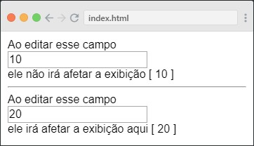

# Curso Básico de Vue (em desenvolvimento...)
Curso básico apresentando um pouco de html, javscript e principalmente VueJs. Estou criando meu material de estudo para futuramenten criar vídeos utilizando esse documento. ***como é difícil tentar usar isso no telefone algumas vezes para colocar marcações***


### objetivo

- criar planejamento do curso, e definir o que será explanado
- a ideia é apresentar cada seção do curso em 10 minutos, se ultrapassar, deverá ser feita uma quebra do vídeo/conteúdo, devido a limitação dos 10 minutos.
- usar dados da fonte oficial vuejs.org
- pesquisar conteúdo de entusiatas de vuejs
- aplicar exemplos 
- revisar todo o conteúdo
- necessario dividir em arquivos
- incluir um pouco sobre html
---

Esse curso básico de Vue será divido em duas partes: 
- Na primeira parte irei falar do JavaScript, apresentando o básico da linguagem dessa fantástica linguagem de programação, e ter o mínimo de conhecimento necessário para poder entender de VueJs.

- Na segunda parte irei falar do VueJs, apresentando um pouco desse maravilhoso framework, e após termino do curso você terá uma base inicial de conhecimento para construir teus próprios códigos em VueJs.

# Primeira Parte - JavaScript

[criar menu]
Variáveis
número inteiro


## JavaScript

## O que é JavaScript?

---
## Variáveis

Variáveis são extremamente importantes durante o desenvolvimento de programas, apps, sites e etc, pois através das variáveis alocamos um espaço na memória do computador e guardamos valores para usar posteriormente, esses valores podem ser números, texto, resultado de algum cálculo, imagens ou até documentos, por esse motivo as variáveis são importantes no desevolvimento.
As variaveis em javascript são **"case-sensitive"**, isso quer dizer que uma variável chamada ```nome``` é diferente de outra chamada ```Nome``` ou ```NOME```, e por recomendação devemos utilizar somente letras, números e o caracter "sublinhado" "\_", em alguns casos utilizamos o "cifrão" "$", mas para começar o nome da variável jamais devemos iniciar ela com algum número no nome.


Criamos as variáveis usando por exemplo:

- usando o **var** seguido do nome da variável, sinal de igual e depois o valor atribuído
```javascript
  var nome_variavel = 'valor da variável' // texto
  var outra_variavel = 123 // numero
```

- usando o **let** seguido do nome da variável, sinal de igual e depois o valor atribuído, *let* quer dizer que a variável poderá receber um valor ao qual irá modificar durante a execução do seu código
```javascript
  let nome_variavel_let = 'sou uma variavel que muda de valor' // texto
  let outra_variavel_let = false // boleana
 ```

- usando o **const** seguido do nome da variável, sinal de igual e depois o valor atribúido, o *const* quer dizer que a variável não poderá modificar o seu valor durante a execução do seu código
```javascript
  const nome_variavel_const = 'sou uma variavel que nao muda de valor' // texto
  const outra_variavel_const = [1, 2, 3, 4] // vetor
```

> o ***let*** e o ***const*** são palavras chaves do javascript, e elas foram incluídas no **[ECMAScript 2015](https://pt.wikipedia.org/wiki/ECMAScript)**
 

### Variáveis do tipo texto

São variáveis do tipo texto, quando setamos o valor a ela usando valores entre aspa simples `'valor exemplo'` ou entre aspa dupla `"valor exemplo"`.

>Elas são conhecidas como ***"string"***

***exemplos:***
```javascript
var usuarioPrincipal = 'taranttini';
var usuario_secundario = 'taranttini';
var email = 'taranttini@email.com';
var senha = '123456';
var data_nascimento = '01-01-1900';
var mensagem_inicial = 'olá eu sou uma mensagem de boas vindas, ao acessar o novo sistema que está sendo construido';
```

### Variáveis do tipo número inteiro

São variáveis do tipo número interio, quando setamos o valor de números sem o uso das aspas.

>Elas são apresentadas com ***"integer"***

***exemplos:***
```javascript
var numero_dez = 10;
var numero_negativo = -50;
var ano2000 = 2000;
var dia_1 = 1;
var numero_grande = 123456790;
var numero_maximo_seguro = 9007199254740991;
```

### Variáveis do tipo ponto flutuante / decimal

São variáveis do tipo ponto flutuante, quanto setamos valores com um `'ponto' .` juntamente com os números.

>Elas são conhecidas como ***"float"***

***exemplos:***
```javascript
var valor_pi = 3.14159265359;

// diferente do modelo brasileiro de números, 
// o decimal é utilizado através do ponto 
var dez_reais_e_cinquenta_centavos = 10.50; 
var mil_e_vinte_centavos = 1000.20; 

// diferente do modelo brasileiro de números,
// a milhar não se usa pontuações
var dez_mil_e_um_centavo = 10000.01;
```

### Variáveis do tipo boleana

São variáveis do tipo boleana, quando setamos valores `true` ou `false`, no caso verdadeiro ou falso, ligado ou desligado, sim ou não;

>Elas são conhecidas como ***"boolean"***

```javascript
var verdadeiro = true;
var falso = false;
var ligado = 1; // 1 também pode ser considerado como verdadeiro
var desligado = 0; // 0 também pode ser considerado como falso
```

### Variáveis do tipo vetor

São variáveis do tipo vetor, quando setamos valores entre `'colchetes' [ ... ]`, e separamos cada valor com 'virgula ,' e dentro dele colocamos inteiros, texto, boleanos, outros vetores, objetos, ponto flutuante, o vetor não precisa receber somente valores do mesmo tipo, eles podem ser variados.

>Elas são conhecidas como ***"array"***

```javascript
var vetor_de_internos = [1,2,3,4];
var vetor_de_boleanos = [true, false, false, true];
var vetor_de_vogais = ['a','e','i','o','u']; 
var vetor_misturado = [1,true,'a',-10,'diversos'];
```

### Variáveis do tipo objeto

São variáveis do tipo objeto, quanto setamos valores entre `'chaves' { ... }`, e dentro dele definimos, parametros e valores, esses valores podem ser inteiros, texto, boleanos, vetores, outros objetos, ponto flutuante, nula ou indefindo. O objeto pode conter 0 ou inúmeros parametros com valores. As propriedades do objeto podem ser acessadas/chamadas usando por exemplo `objeto.propriedade` ou `objeto['propriedade']`.

```javascript
var objeto_pessoa = {
    nome: 'taranttini',
    site: 'http://github.com',
    ano: 2019,
    mes: 1
};
var objeto_data = { dia: 27, mes: 1, ano: 2019 };
var objeto_documento = { tipo: 'rg', numero: 121231230, valido: true };
var objeto_vazio = {};

//exemplo para acessar alguma propriedade do objeto_pessoa
objeto_pessoa.nome; //isso retornará 'taranttini'
objeto_pessoa['ano']; //isso retornará 2019
```


>Elas são conhecidas como ***"object"***

### Variáveis do tipo nula

São variáveis do tipo nula, quando elas recebem o valor `null`, usamos ela para limpar a variável, quando por exemplo tinhamos um valor qualquer, e queremos limpar esse valor, ai setamos o `null`.

```javascript
var variavel_nula = null;
var outra_variavel_nula = null;
var nome = 'taranttini';
// agora vamos limpar a variável nome
nome = null;
```

>Elas são conhecidas como ***"null"***

### Variáveis do tipo indefinida

São variáveis do tipo indefinida, quando criamos uma varíavel e não setamos valor algum para ela, ou quando setamos ela com o valor `undefined`, nesse caso queremos dizer que o valor da varíavel é indefinido nesse momento de código.

```javascript
var variavel_indefinida_nao_setada;
var variavel_indefinida = undefined;
// vamos criar um objeto, e tentar localizar uma propriedade;
var pessoa = {};
pessoa.nome; // nesse caso ao tentar chamar o nome da pessoa, ela será considerada "undefined", pois em momento algum definimos o nome a ela.
```

>Elas são conhecidas como ***"undefined"***

---

## Operadores/Operações

Para desenvolvermos programas de computador, constumamos resolver cálculos dos mais variados tipos tais como, soma, subtração, multiplicação, divisão, alguma validação lógica como por exemplo verifica se os valores são verdadeiros ou falsos, se alguma valor é maior, menor ou igual a outro valor.

Esses calculos são realizados através da utilização de símbolos matemáticos, e alguns deles em forma de símbolo matemático específicos a sua linguagem de programação, no nosso caso específicos da linguagem javascript.


### Operadores aditivos: soma e subtração


***Soma:*** Devemos utilizar o sinal de `'mais' '+'` para realizar uma soma
```javascript
1 + 2; // o resultado será 3
```
***Subtração:*** Devemos utilizar o sinal de `'menos' '-'` para realizar uma subtração
```javascript
2 - 1; // o resultado será 1
```
### Operdores multiplicativos: multiplicação, divisão e resto da divisão

***Multiplicação:*** Devemos utilizar o sinal de `'asterisco/estrela' '*'` para realizar uma multiplicação

```javascript
2 * 3; // o resultado será 6
```

***Divisão:*** Devemos utilizar o sinal de `'barra' '/'` para realizar uma divisão
```javascript
10 / 2; // o resultado será 5
```

***Resto da Divisão:*** Devemos utilizar o sinal de `'porcentagem' '%'` para obter o resto de uma divisão
```javascript
10 % 3; // o resultado será 1
```

### Operadores incrementais: servem para adicionar +1 ao valor original da variável

***Pré-incremental*** Devemos utilizar o sinal de mais, mais `++` __***antes***__ do nome da variável

```javascript
// no pré-incremental a soma acontece de imediado

var variavel_x = 1;
++variavel_x // nesse caso a variavel_x terá o valor de 2
// mas ao chamar ela novamente, ele terá o mesmo valor, pois o incremento já ocorreru anteriormente
variavel_x // agora o valor será 2
// se chamar a variavel_x novamente ela ainda será 2
variavel_x // o valor continuará sendo 2
```

***Pós-incremental*** Devemos utilizar o sinal de mais, mais `++` __***depois***__ do nome da variável

```javascript
// no pós-incremental a soma só acontece depois

var variavel_y = 1;
variavel_y++ // nesse caso o y terá o valor de 1
// mas ao chamar ela novamente, ela terá o incremento posterior, pois ela acontece somente depois
variavel_y // agora o valor será 2
// se chamar a variavel_y novamente ela ainda será 2
variavel_y // o valor continuará sendo 2
```


### Operadores decrementais: servem para subtrair -1 ao valor original da variável

***Pré-decremental*** Devemos utilizar o sinal de menos, menos `--` __***antes***__ do nome da variável

```javascript
// no pré-decremental a subtração acontece de imediado

var variavel_x = 3;
--variavel_x // nesse caso a variavel_x terá o valor de 2
// mas ao chamar ela novamente, ele terá o mesmo valor, pois o decremento já ocorreru anteriormente
variavel_x // agora o valor será 2
// se chamar a variavel_x novamente ela ainda será 2
variavel_x // o valor continuará sendo 2
```

***Pós-decremental*** Devemos utilizar o sinal de menos, menos `--` __***depois***__ do nome da variável

```javascript
// no pós-decremental a subtração só acontece depois

var variavel_y = 3;
variavel_y-- // nesse caso o y terá o valor de 3
// mas ao chamar ela novamente, ela terá o decremento posterior, pois ela acontece somente depois
variavel_y // agora o valor será 2
// se chamar a variavel_y novamente ela ainda será 2
variavel_y // o valor continuará sendo 2
```

### Operadores de igualdade: servem para validar se dois ou mais valores são iguais

***Igualdade***: Devemos utilizar o sinal de  `'igual, igual'` `'=='` para validar se dois valores são `iguais`

```javascript
// declarando variaveis
var variavel_a = 1;
var variavel_b = 1;

// validar ser variavel_a é igual a variavel_b
variavel_a == variavel_b; // 1 == 1 retorna true, pois são iguais

// setando outro valor para variavel_b
variavel_b = 2;

// validar ser variavel_a é igual a variavel_b
variavel_a == variavel_b; // 1 == 2 retorna false, pois não são iguais
```


***Diferença***: Devemos utilizar o sinal de `'exclamação, igual'` `'!='` para validar se dois valores são `diferentes`

```javascript
// declarando variaveis
var variavel_a = 1;
var variavel_b = 1;

// validar ser variavel_a é diferente da variavel_b
variavel_a != variavel_b; // 1 != 1 retorna false, pois não são diferentes

// setando outro valor para variavel_b
variavel_b = 2;

// validar ser variavel_a é diferente da variavel_b
variavel_a != variavel_b; // 1 != 2 retorna true, pois são diferentes
```

### Operadores relacionais: servem para validar se o valor é maior que, menor que, maior que ou igual, menor que ou igual, ao outro valor.

***Maior que***: Devemos utilizar o `'sinal maior'` `'>'` para validar se um valor é maior que o outro

~~~javascript
// declarando variaveis
var variavel_a = 2;
var variavel_b = 1;

// valida se variavel_a é maior que variavel_b
variavel_a > variavel_b; // 2 > 1 retorna true, pois variavel_a é maior que variavel_b

// setando outro valor
variavel_b = 3;

// valida se variavel_a é maior que variavel_b
variavel_a > variavel_b; // 2 > 3 retorna false, pois variavel_a não é maior que variavel_b
~~~

***Menor que***: Devemos utilizar o `'sinal menor'` `'<'` para validar se um valor é menor que o outro

~~~javascript
// declarando variaveis
var variavel_a = 2;
var variavel_b = 1;

// valida se variavel_a é menor que variavel_b
variavel_a < variavel_b; // 2 < 1 retorna false, pois variavel_a não é menor que variavel_b

// setando outro valor
variavel_b = 3;

// valida se variavel_a é menor que variavel_b
variavel_a < variavel_b; // 2 < 3 retorna true, pois variavel_a é menor que variavel_b
~~~

### Operadores lógicos: servem para validar se:

**E lógico, AND**: Devemos utilizar `'E comercial, E comercial'` `'&&'` para validar se condição 1 `'E'` condição 2 são verdadeiras

~~~javascript
// variaveis
var valor_a = 1;
var valor_b = 1;
var valor_c = 2;
var texto_a = 'um';
var texto_b = 'um';
var texto_c = 'dois';

// condições
var condicao_1 = valor_a == valor_b; // 1 == 1         -> true
var condicao_2 = texto_a == texto_b; // 'um' == 'um'   -> true
var condicao_3 = valor_a != valor_b; // 1 != 1         -> false
var condicao_4 = texto_a != texto_b; // 'um' != 'um'   -> false
var condicao_5 = valor_a != valor_c; // 1 != 2         -> true
var condicao_6 = texto_a != texto_c; // 'um' != 'dois' -> true
var condicao_7 = valor_a == valor_c; // 1 == 2         -> false
var condicao_8 = texto_a == texto_c; // 'um' == 'dois' -> false

// validações simples

// condicao_1 E/AND condicao_2
// ambas condições verdadeiras, resulta em verdade
condicao_1 && condicao_2; // true AND true -> true

// condicao_3 E/AND condicao_4
// ambas condições falsa, resulta em falso
condicao_3 && condicao_4; // false AND false -> false

// condicao_1 E/AND condicao_3
// uma condição falsa, resulta em falso
condicao_1 && condicao_3; // true AND false -> false

// condicao_4 E/AND condicao_2
// uma condição falsa, resulta em falso
condicao_4 && condicao_2; // false AND true -> false

// condicao_5 E/AND condicao_6
// ambas condições verdadeiras, resulta em verdade
condicao_5 && condicao_6; // true AND true -> true

// condicao_7 E/AND condicao_8
// ambas condições falsa, resulta em falso
condicao_7 && condicao_8; // false AND false -> false

// validações complexas

// valor_a igual a valor_b E/AND texto_a igual a texto_b
// (1 == 1) && ('um' == 'um')
(valor_a == valor_b) && (texto_a == texto_b); // true AND true -> true

// (valor_a diferente de valor_c) E/AND (texto_a diferente de texto_c)
// 1 != 2 && 'um' != 'dois' -> true
(valor_a != valor_c) && (texto_a != texto_c); // true AND true -> true
~~~

**OU lógico, OR**: Devemos utilizar `'pipe, pipe ou barra vertical, barra vertical'` `'||'` para validar se condição 1 `'OU'` condição 2 são verdadeiras ou se uma é verdadeira


~~~javascript
// variaveis
var valor_a = 1;
var valor_b = 1;
var valor_c = 2;
var texto_a = 'um';
var texto_b = 'um';
var texto_c = 'dois';

// condições
var condicao_1 = valor_a == valor_b; // 1 == 1         -> true
var condicao_2 = texto_a == texto_b; // 'um' == 'um'   -> true
var condicao_3 = valor_a != valor_b; // 1 != 1         -> false
var condicao_4 = texto_a != texto_b; // 'um' != 'um'   -> false
var condicao_5 = valor_a != valor_c; // 1 != 2         -> true
var condicao_6 = texto_a != texto_c; // 'um' != 'dois' -> true
var condicao_7 = valor_a == valor_c; // 1 == 2         -> false
var condicao_8 = texto_a == texto_c; // 'um' == 'dois' -> false

// validações simples

// condicao_1 OU/OR condicao_2 
// ambas condições verdaderias, resulta em verdade
condicao_1 || condicao_2; // true OR true -> true

// condicao_3 OU/OR condicao_4
// ambas condições falsas, resulta em false
condicao_3 || condicao_4; // false OR false -> false

// condicao_1 OU/OR condicao_3
// uma condição verdadeira, resulta em verdade
condicao_1 || condicao_3; // true OR false -> true

// condicao_4 OU/OR condicao_2
// uma condição verdadeira, resulta em verdade
condicao_4 || condicao_2; // false OR true -> true

// condicao_5 OU/OR condicao_6
// ambas condições verdaderias, resulta em verdade
condicao_5 || condicao_6; // true OR true -> true

// condicao_7 OU/OR condicao_8
// ambas condições falsas, resulta em false
condicao_7 || condicao_8; // false OR false -> false

// validações complexas

// valor_a igual a valor_b OU/OR texto_a igual a texto_b
// (1 == 1) || ('um' == 'um')
(valor_a == valor_b) || (texto_a == texto_b); // true OR true -> true

// (valor_a diferente de valor_c) OU/OR (texto_a diferente de texto_c)
// 1 != 2 || 'um' != 'dois' -> true
(valor_a != valor_c) || (texto_a != texto_c); // true OR true -> true
~~~

**NÃO lógico, NOT**: Devemos utilizar `'exclamação'` `'!'` antes da variável ou condição, para negar e dizer que a variável ou condição `'NÃO'` é verdadeira ou `'NÃO'` é falsa

~~~~javascript
// variaveis
var valor_a = 1;
var valor_b = 1;
var valor_c = 2;
var texto_a = 'um';
var texto_b = 'um';
var texto_c = 'dois';

// condições
var condicao_1 = valor_a == valor_b; // 1 == 1         -> true
var condicao_2 = texto_a == texto_b; // 'um' == 'um'   -> true
var condicao_3 = valor_a >= valor_c; // 1 >= 2         -> false
var condicao_4 = texto_a != texto_c; // 'um' == 'dois' -> false

// validações

// estou negando que a condição é não é verdade, retornado falso
!condicao_1; // NOT true -> false

// estou negando que a condição é não é falsa, retornado verdade
!condicao_3; // NOT false -> true

// NOT true AND NOT true -> false && false 
!condicao_1 && !condicao_2; // false

// NOT true AND true -> false && true 
!condicao_1 && condicao_2; // false

// true AND NOT true -> true && false
condicao_1 && !condicao_2; // false

// NOT false OR NOT false ->  true OR true 
!condicao_3 || !condicao_4; // true

// NOT false OR false -> true OR false
!condicao_3 || condicao_4; // true

// false OR NOT false -> false OR true
condicao_3 || !condicao_4; // true

!true // NOT true -> false

!false // NOT false -> true

!1 // NOT 1 -> false

!0 // NOT 0 -> true
~~~~


> true = verdadeiro \
> false = falso

### Tabela verdade `&&` (E / AND)

| Condição 1 | Operador | Condição 2 | Resultado |
|:--------:|:--------:|:--------:|---------:|
| true | && | false | false |
| false | && | true | false |
| true | && | true | true|
| false | && | false |	false |

### Tabela verdade `||` (OU / OR)

| Condição 1 | Operador | Condição 2 | Resultado |
|:--------:|:--------:|:--------:|---------:|
| true | \|\| | false	| true |
| false | \|\| | true	| true |
| true | \|\| | true | true |
| false | \|\| | false |	false |


---

## Controles de Fluxo e de Repetição

Servem para nos auxiliar em rotinas que só ocorrem durante algumas decisões forem validas positivamente ou negativamente, e podemos ter um controle de fluxo que faz uma coisa ou outra coisa conforme a decisão, ou ter outro controle que irá repetir um trecho de código enquanto tivermos uma decisão aceitavel para a mesma.

***Controle de fluxo `'IF'`:*** serve para validar 'SE' uma condição é satisfatória

~~~javascript
// if ( condição )
if (1 == 1) {
  // realiza a rotina que estiver aqui dentro
}
~~~

Então se a condição for satistaória ela irá realizar aquele trecho de código, se não for satisfatória o programa simplesmente irá ignorar aquele trecho de código.

~~~javascript
var a = 1;
var b = 2;
if (1 < 2) {
  console.log('codigo do se')
}
console.log('fim')
// aqui temos a saída : codigo do se e fim
~~~

~~~javascript
var a = 1;
var b = 2;
if (1 > 2) {
  console.log('codigo do se')
}
console.log('fim')
// aqui temos a saída : fim
~~~

***Controle de fluxo `'ELSE'`:*** serve para auxiliar a condição 'IF', que no caso é a condição contrária do 'SE', então 'SE' uma condição não for satisfatória, o programa irá executa o trecho de código  referente do 'SENÃO'

~~~javascript
var a = 1;
var b = 2;
if (1 > 2) {
  console.log('codigo do se')
}
else {
  console.log('codigo do senao')
}
console.log('fim')
// aqui temos a saída : codigo do senao e fim
~~~

Então se a condição for satistaória ela irá realizar aquele trecho de código, se não for satisfatória o programa ele ira ignorar o techo de código do se, e simplesmente irá executar o trecho de código do senão.

***Controle de repetição `'FOR'`:*** serve para criar uma estrutura de repetição, onde ele irá repetir um bloco de código para toda a condição satisfatória, no caso do `for` temos:

~~~javascript
for (var i=0; i<3; i++) {
  console.log(i);
}
~~~


> Para variável i igual à 0; \
Se `i` for menor que 3; \
Realiza o código dentro das chaves; \
Soma 1 no `i`; \
Repete todo o procedimento se o `i` for menor que 3; \


Então temos o passo a passo:

1. para `i = 0`;\
   se `0 < 3;` *//sim* \
   `imprime o conteudo de i;` *//0* \
   `i++;` *// após realizar o conteúdo das chaves ele irá somar +1 ao i*
    
2. para `i = 1;` *// por causa do i++* \
   se `1 < 3;` *// sim* \
   `imprime o conteúdo de i;` *//1* \
   `i++;` *// após realizar o conteúdo das chaves ele irá somar +1 ao i*

3. para `i = 2;` *// por causa do i++* \
   se `2 < 3;` *// sim* \
   `imprime o conteúdo de i;` *//2* \
   `i++;` *// após realizar o conteúdo das chaves ele irá somar +1 ao `i`* 
  
4. para `i = 3;` *// por causa do i++* \
   se `3 < 3;` *// não* \
   *// como a condição não é mais satisfatória ele não irá mais executar o código das chaves e simplesmente finaliza a estrutura*

  
> Para variável `i` igual à 0; \
Se `i` for menor que 10; *// repete procedimento* \
realiza código \
Soma 1 no `i` 

~~~javascript
for (var i=0; i<10; i++) {
  console.log(i);
}
~~~

O código acima seria o mesmo que esse código abaixo:

~~~javascript
var i=0;
console.log(i++); //0
console.log(i++); //1
console.log(i++); //2
console.log(i++); //3
console.log(i++); //4
console.log(i++); //5
console.log(i++); //6
console.log(i++); //7
console.log(i++); //8
console.log(i++); //9
~~~
Fazer isso acima é um pouco feio, então a estrutura de repetição nos ajuda a montar um código mais limpo ou reduzido.

Também podemos fazer decrescente:

> Para variável `i` igual à 10; \
Se `i` for maior que 0; *// repete procedimento \
realiza código* \
Subtrai 1 no `i` 

~~~javascript
for (var i=10; i>0; i++) {
  console.log(i);
}
~~~

***Controle de repetição `'WHILE'`:*** serve para criar uma estrutura de repetição, onde ele irá repetir um bloco de código enquanto a condição for satisfatória, no caso do while temos:

> Declaro variável `i` igual à 0; \
\
Enquanto `i` menor que 3; *// repete procedimento* \
realiza o código \
Soma 1 no `i`

Então temos o passo a passo:


1. `var i = 0`; *// variável inicial*

2. enquanto `0 < 3;` *// sim* \
   `imprime o conteudo de i;` *//0* \
   `i++;` *// irá somar +1 ao i* \
   `i = 1;` *// por causa do i++*
    
3. enquanto `1 < 3;` *// sim* \
   `imprime o conteúdo de i;` *//1* \
   `i++;` *// irá somar +1 ao i* \
   `i = 2;` *// por causa do i++*

4. enquanto `2 < 3;` *// sim* \
   `imprime o conteúdo de i;` *//2* \
   `i++;` *// irá somar +1 ao i* \
   `i = 3;` *// por causa do i++*
   
5. enquanto `3 < 3;` *// não* \
   *// como a condição não é mais satisfatória ele não irá mais executar o código das chaves e simplesmente finaliza a estrutura*

> Declaro variável inicial `i` igual à 0; \
\
Enquanto `i` menor que 10; *// repete procedimento* \
realiza o código \
Soma 1 no `i`

~~~javascript
var i = 0; //inicializo

while (i < 10) {
  console.log(i);
  i++;
}
~~~

Também podemos fazer decrescente:

> Declaro variável inicial `i` igual à 10; \
\
Enquanto `i` maior que 0; *// repete procedimento* \
realiza o código \
Subtrai 1 no `i`

~~~javascript
var i = 10; // inicializo

while (i > 0) {
  console.log(i);
  i--;
}
~~~

***Controle de repetição `'DO-WHILE'`:*** serve para criar uma estrutura de repetição, onde ele manda executar um bloco de código, e enquanto a condição for satisfatória ele manda repetir o bloco de código, no caso do do-while temos:


> Declaro variável `i` igual à 0; \
\
Faça \
realiza o código \
Soma 1 no `i` \
Enquanto `i` menor que 3; *// repete procedimento*

Então temos o passo a passo:

1. `var i = 0`; *// variável inicial*

2. `imprime o conteudo de i;` *//0* \
   `i++;` *// irá somar +1 ao i* \
   `i = 1;` *// por causa do i++* \
   `1 < 3;` *//sim* 
    
3. `imprime o conteúdo de i;` *//1* \
   `i++;` *// irá somar +1 ao i* \
   `i = 2;` *// por causa do i++* \
   `2 < 3;` *// sim*

4. `imprime o conteúdo de i;` *//2* \
   `i++;` *// irá somar +1 ao i* \
   `i = 3;` *// por causa do i++* \
   `3 < 3;` *// sim*
   
5. *// como a condição não é mais satisfatória ele não irá mais executar o código das chaves e simplesmente finaliza a estrutura*

Usando a estrutura do-while, primeiro ele executa a instrução, e só irá repetir as mesmas instruções se a condição for satisfatória

~~~javascript
var i = 1; // inicializo

do {
  console.log(i);
  i++;
} while (i > 5)
~~~

No exemplo acima, ele irá executar o código ao menos 1 vez, mas não irá repetir a instrução pois ela não será mais satisfatória.

> Declaro variável `i` igual à 0; \
\
Faça \
realiza o código \
Soma 1 no `i` \
Enquanto `i` menor que 10; *// repete procedimento*

~~~javascript
var i = 0; // inicializo

do {
  console.log(i);
  i++;
} while (i < 10)
~~~

***Controle de repetição `'FOR IN'`:***
~~~javascript
var lista = ['a','b','c'];

for (var i in lista) {
  console.log(i);
}
~~~

***Controle de repetição `'FOR ON'`:***
~~~javascript
var lista = ['a','b','c'];

for (var i on lista) {
  console.log(i);
}
~~~

***Controle de repetição `'continue'`:*** serve para pular para a próxima interação do laço de repetição, sem executar as próximas linhas de códígo

***Controle de repetição `'break'`:*** serve para encerrar o código dentro do laço de repetição, assim sendo ele finaliza o bloco de código e não continua mesmo que tenha mais interações a serem realizadas.


---

## Funções

Função representa um pequeno bloco de instruções que fazem uma ou mais tarefas, a função poderá ter algum retorno ou não, as funções são apresentadas da seguinte forma `function NomeDaFuncao() { /* codigo do que ela fará */}`.

```javascript
// essa função irá somar e retornar 2 valores pré definidos
function ProcessaSoma() {
  var valor_a = 20;
  var valor_b = 40;
  return valor_a + valor_b;
}
// ao chamar a função da seguinte forma
ProcessSoma(); // teremos o retorno 60
// já que a função calculou internamente o valor de 20 + 40 = 60


// agora vamos criar uma função que irá calcular 2 valores que passarmos por parametros, 
// assim deixaremos a função de uma forma dinamica e mais útil, 
// porque a função anterior não tem muita utilidade, 
// já que trará o mesmo valor sempre que for chamada

function ProcessaDoisValores(valor_a, valor_b) {
  return valor_a + valor_b;
}
// ao chamar a função da seguinte forma
ProcessaDoisValores(5, 10); // teremos o retorno 15
// pois passamos os valores 5 e 10 por parametro, 
// e internamente a função calculou o 5 + 10 = 15

// mas agora também podemos fazer o uso da mesma função passando outros parametro
ProcessaDoisValores(1, 2); // teremos 3
ProcessaDoisValores('nome', 'sobrenome'); // teremos nomesobrenome
// isso mesmo, ao passar dois valores texto, 
// o javascript irá concaternar os mesmo e retornar ambos juntos.
```

As funções são muito úteis para realizar tarefas específicas, pois iremos codificar o que precisamos que ela faça. Um programa feito em javascript poderá ter muitas funções.


# Segunda Parte - Vue

## Vue

## O que é Vue?

## Como usar o Vue?

Podemos usar o vue js simplesmente fazendo o download o arquivo vue.js localizado em https://br.vuejs.org/js/vue.js e depois acrescentar o uso da tag ```<script src="caminho do arquivo vue.js"></script>``` dentro do seu arquivo html.

Podemos usar o vue js fazendo a referência a uma **CDN** (Content Delivery Network - Rede de Distribuição de Conteúdo), que seriam diversos servidores espalhados pelo mundo armazenando o mesmo conteúdo em cada servidor referente a essa CDN, o conteúdo é armazenado em memória(cache), e quando solicitamos algum arquivo desses servidores, ele tenta retornar esse dado do servidor mais próximo a nós, fazendo ser bem rápido suas respostas ao conteúdo solicitado. Mas seria parecido com o modo anterior, tag ```<script src="https://cdn.jsdelivr.net/npm/vue@2.5.21/dist/vue.js"></script>``` dentro do seu arquivo html.

Para aplicações de grande escala (muitos arquivos, muitas linhas de código), é recomendado o uso do vue através do **NPM** (Node Package Manager - Gerenciador de Pacotes do Node), que é uma ferramenta de linha de comando que nos ajuda a instalar diversas bibliotecas que possam ser úteis em nosso projeto, e também inclui empacotadores de módulos tais como ***[Webpack](https://webpack.js.org/)*** ou ***[Browserify](http://browserify.org/)*** . Exemplo de uso do npm ```npm install vue``` 

Além do **[CLI oficial](https://github.com/vuejs/vue-cli)**, outra ferramenta de linha de comando, que permite através de poucos comandos criar toda a estrutura de um grande projeto vue, permite criar o projeto para ambiente de desenvolvimento ou produção, e com toda estrutura para realizar testes unitários ou de toda a aplicação, além de plugins para minimizar o código, hotreload (que ao salvar o arquivo ao qual editamos, já podemos ver o resultado em tempo real), validações de erros, entre tantas outras configurações. 

### Exemplo de código

> ```arquivo: index.html``` 
```html
<html>
<head>
  <title>Exemplo, olá mundo Vue</title>
  <script src="https://cdn.jsdelivr.net/npm/vue@2.5.21/dist/vue.js"></script>
</head>

<body>
  <div id="app">
    {{ mensagem }}
  </div>

  <script>
    var app = new Vue({
      el: '#app',
      data: {
        mensagem: 'Exemplo, olá mundo Vue!'
      }
    })
  </script>
</body>
</html>
```
O exemplo acima tem o seguinte resultado no navegador:


# Variaveis


No vue js, podemos fazer uso das variáveis dentro de métodos, mas elas também são apresentadas dentro do objeto ou método `'data'`, essas variáveis postas dentro de data, podem ser **rendenizados** dentro dos **templates** html.

~~~html
<div id="app">
  {{variavel_a}}
  {{variavel_b}}
</div>
~~~

~~~javascript
var app = new Vue({
  el: '#app',
  data() {
    return {
      variavel_a: 1,
      variavel_b: 'nome',
      ...
    }
  }
})
~~~
O exemplo acima tem o seguinte resultado no navegador:


~~~html
<div id="app">
  <div>{{ variavel_texto }}</div>
  <div>{{ variavel_numero_inteiro }}</div>
  <div>{{ variavel_ponto_flutuante }}</div>
  <div>{{ variavel_boleana }}</div>
  <div>{{ variavel_vetor }}</div>
  <div>{{ variavel_objeto }}</div>
  <div>{{ variavel_nula }}</div>
  <div>{{ variavel_indefinida }}</div>
</div>
~~~
```javascript
  var app = new Vue({
    el: '#app',
    data: {
      variavel_texto: 'texto', //variavel tipo texto'
      variavel_numero_inteiro: 1, //variável tipo número inteiro
      variavel_ponto_flutuante: 1.2345, //variável tipo ponto flutuante / decimal
      variavel_boleana: true, //variável tipo boleana
      variavel_vetor: [1,2,3], //variável tipo vetor
      variavel_objeto: {nome:'usuario', idade: 10}, //variável tipo objeto
      variavel_nula: null, //variável tipo nula
      variavel_indefinida: undefined, //variável tipo indefinida
    }
  })
```
O exemplo acima tem o seguinte resultado no navegador:


## Diretivas

No Vue.js temos diversas diretivas que auxiliam na construção do código, elas são prefixadas iniciando com `'v-'` para indicar que são atributos especiais do vue, e cada uma tem comportamentos diferentes.

~~~html
<div id="app">
    <div>Ao editar esse campo</div>
    <div><input type="text" v-bind:value="variavel_a" /></div>
    <div>ele não irá afetar a exibição [ {{variavel_a}} ]</div>
    <hr>
    <div>Ao editar esse campo</div>
    <div><input type="text" v-model="variavel_b" /></div>
    <div>ele irá afetar a exibição aqui [ {{variavel_b}} ] </div>
</div>
~~~
~~~javascript
var app = new Vue({
  el: '#app',
  data() {
    return {
      variavel_a: 10,
      variavel_b: 20,
      ...
    }
  }
})
~~~

No exemplo acima temos as seguintes diretivas `'v-bind'` e `'v-model'`:

No caso do `v-bind` ele consegue exibir o valor da `variavel_a` dentro da propriedade `value` do `input`, mas ao modificar o valor do campo ele não irá atualizar o valor da `variavel_a`, nesse caso ela continuará sendo `'10'`.

No caso do `v-model`, ele consegue exibir o valor da `variavel_b` dentro da propriedade `value` do `input`, mas ao modificar o valor do campo ele automaticamente irá atualizar o valor da `variavel_b`, nesse caso irá assumir o valor que for informado.

Exemplo Inicial



Exemplo Modificado


> Aqui se percebe que ao modificar o valor do campo, ele modificou o valor dentro dos colchetes, e a `variavel_b` terá o valor `20 modificado`

### Tipos de Diretivas

**v-text**

**v-html**

**v-show**

**v-if** 

Com essa diretiva podemos exibir o conteúdo que estiver dentro da tag html que ela estiver associada caso a condição v-if for satisfatória, é um validador de condicional que funciona da mesma forma do if do javascript padrão.

**v-else**

Com essa diretiva podemos exibir a contradição do v-if, onde o v-if não for satisfatório ele poderá exibir o conteúdo que estiver no v-else, é um validador condicional que funciona da mesma forma do else do javascript padrão.

**v-for**

**v-on**

**v-bind**

**v-model**

Com essa diretiva é possivel fazer uma amarração entre uma tag especifica do html com uma variavel definida em vue, o v-model funciona para as tags `input`, `textarea` e `select`. Sendo assim ao usar essas tags html e modificar os valores desses elementos, ele automaticamente atualiza o valor da variável, v-model é conhecido como Two Way Databind.

**v-pre**

Com essa diretiva é possivel exibir as chaves e conteúdo sem a formatação do html ou do template rendenizado do vue, então da forma que for posto o conteúdo dentro do v-pre, ele será exibido 100% original sem sofrer nenhuma formatação/interpretação por parte do navegador.

**v-cloak**

**v-once**

## Funções

No Vue.js as funções, ficarão definidas dentro da propriedade `methods: {}`, e elas são definidas sem o uso da palavra chave `'function'`, ficando somente o nome da função e os parametros necessários.

```javascript
new Vue({
  el: '#app',
  methods: {
    // aqui temos uma respresentação da soma de dois valores 
    retornaSoma(valor_a, valor_b) {
      return valor_a + valor_b
    }
    // aqui temos uma respresentação da multiplicação de dois valores 
    retornaMultiplicacao(valor_a, valor_b) {
      return valor_a * valor_b
    }
  }
})
```
